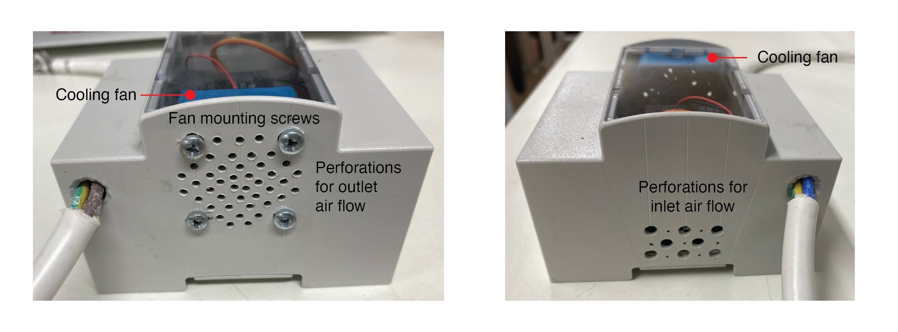
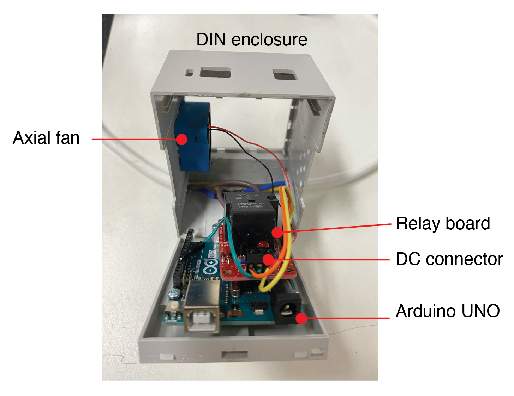
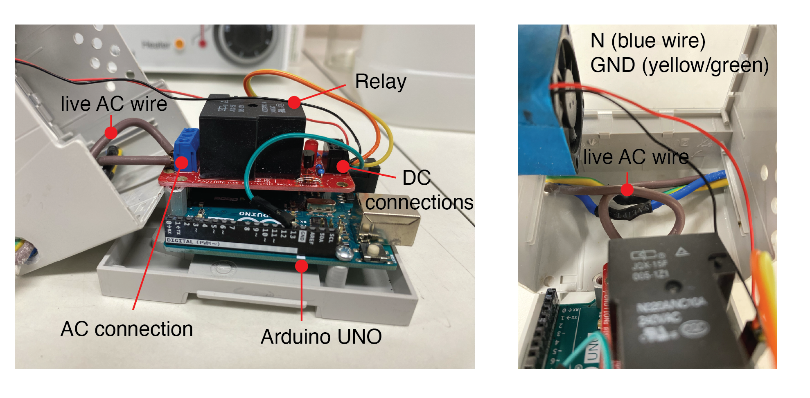
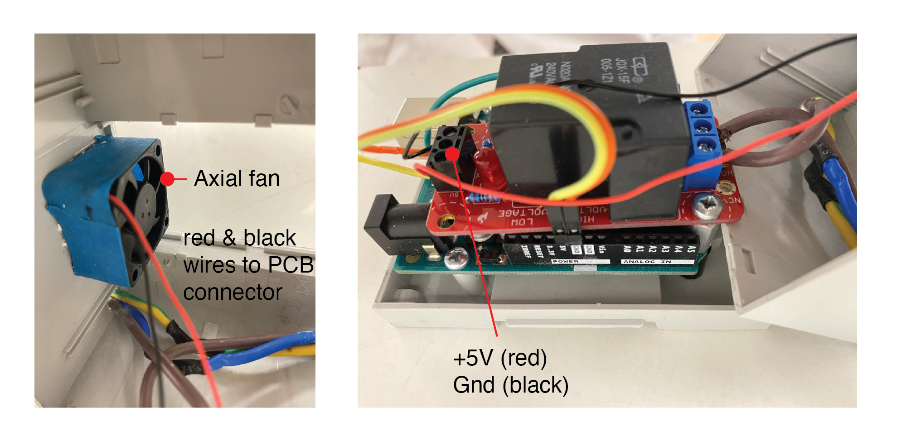

# Build Instructions and Notes

### Operating Principles

The approach is an extension of what is described...


## Bill of Materials

|Name               |QTY|Description                           |
|:------------------|:-:|:-------------------------------------|
|[DIN enclosure](https://uk.rs-online.com/web/p/cases-for-arduino/8607599)|1  |DIN enclosure for Arduino UNO with transparent window. |
|[Arduino](https://uk.rs-online.com/web/p/arduino/7154081)|1  |Arduino UNO microcontroller|
|[Relay Control Kit](https://www.sparkfun.com/products/13815)|1  |Beefcake relay control kit for high current AC switching.|
|[Axial fan](https://uk.farnell.com/sunon/mc30060v2-0000-a99/fan-30x30x6-9mm-5vdc/dp/1924848)|1  |For actively cooling the electronics inside the enclosure.|
|M4 Screws|4  |10 mm long, for mounting fan to enclosure.|
|M3 standoffs and screws|2  |10 mm long, for mounting the relay pcb above the Arduino UNO.|
|Misc.|   | <ul><li>Wiring and heat shrink</li><li>Soldering Iron and solder</li><li>Glue</li><li>Electrical hand drill and 3-5mm drill bits</li></ul>|

## Modifications

The only modification required is to the DIN enclosure. This is to provide cooling to the electronics, particularly if the relay is controlling a high current load (~ 10-20A) for long periods (> 2 mins) at a time. Holes were drilled on either side of the enclosure to allow air to pass through and across the relay board. The choice of perforated walls with small (~ 3 - 5mm diameter) holes allows air to flow through while preventing the risk of users contacting the AC circuit inside the box. A miniature axial fan (30mm x 30mm x 7mm, $Q_{max} = 3.7$ CFM) was mounted to the inside of the enclosure with the outlet against the perforated enclosure wall. The fan operates in "pull-mode" in this arrangement, drawing in cool external air that heats up and is then expelled from the outlet.  




## Wiring

### Relay to Arduino

GGG



### AC supply to Relay

GGG



### Cooling fan

GGG




## Arduino Code

In this section, I'll comment on the overarching function of the arduino code in `/Arduino Sketches/Pink_Box_v2/Pink_Box_v2.ino`. This contains a routine which runs the blender on and off for the specified amount of time defined at the top of the file.

It is important to stress that interrupt service routines are essential, but also the hardest bit about the project. As `millis()` and `micros()` wont update whilst in the interrupt, and hence mess with the on/off timing which we need to keep accurate. More importantly though, the AC signal requires dimming once every half period of AC ( $10$ $ms$ - $17$ $ms$ ). In summary then, our loop needs to be fast enough to:

- Tell the time
- Read the encoder speed
- Calculate the control signal

And finally,

- Signal the dimmer

All within the $10$ $ms$ between the Zero-Cross signal. The pro micro has a clock speed of $16$ $MHz$, with mains AC being $50$ - $60$ $Hz$, which comes to $160'000$ operations between each Zero-Cross. In context, one division operation takes $\approx 2'000$ clock cycles to compute (division is notoriously slow, [this now defunct blogpost explained it really well](http://www.engblaze.com/faster-code-fridays-understand-division-and-speed-of-operations/)). This turns out to not be enough time to output to the Screen, for instance.

### Encoder Signal

Beginning with the encoder, we trigger the following function on the on a `RISING` edge of the encoder signal.

```
void UpdateCount() {
  COUNT++;
}
```

Reading the number of counts (Stored in `COUNT` and read into `READ_COUNT`) between every $1000$ $ms$ gives us an indication of the speed with a resolution of ± $60$ $rpm$ with a single encoder gap. The maximum feasible number of encoder gaps for this setup seems to be between two and three ( ± $30$ - $20$ $rpm$ resolution). You'll find this beginning at line 217:

```
// Update speed measurement every xxx ms
if (READ_TIME >= 1000) {
OMEGA = ((60*1E3*READ_COUNT)/READ_TIME);

// check for nan values
if (!OMEGA) {
  OMEGA = 0;
  }

Serial.println(OMEGA);
```

We also check the value is a number, as it is sometimes `NAN` when the count is $0$ (i.e. the motor is stopped).

### Dimmer Module

Next is the Zero-Cross interrupt; In this one, we have to do a couple more things than before.

```
void zeroCrossISR() {
  digitalWrite(AC_LOAD, LOW);
  ZERO_STATE[2] = micros();
  ZERO_STATE[1] = 1E3;
}
```
Firstly, we begin by setting the gate pin of the TRIAC (`AC_LOAD`) to `LOW`, which ensures we don't prematurely open the taps to AC straight away. We then take note of the time and set a flag. In our main loop then, we action this at line 242:

```
// Update TRIAC if needed
if (ZERO_STATE[1] == 1E3) {
  ZERO_STATE[3] = micros() - ZERO_STATE[2];
  if (ZERO_STATE[3] >= DIM_TIME) {
    digitalWrite(AC_LOAD, HIGH);   // triac On
    if (ZERO_STATE[3] >= (DIM_TIME + 10)) {
      digitalWrite(AC_LOAD, LOW);  // triac Off
      ZERO_STATE[1]=0;
      }
    }
  }
```
Evaluate the Zero-Cross flag, which when true, we calculate the time since the Zero-Cross was triggered. Once the time reaches the `DIM_TIME` calculated by the PID Control loop, we trigger the gate of the TRIAC to allow the AC to flow. Finally, after a short propogation period ( $10$ $\mu s$ ) for the TRIAC to trigger, the gate is set LOW and the Zero-Cross flag is reset, ready for the next signal from the dimmer.

### PID Control

Next up, we'll look briefly at how the PID control loop is implemented:

**Line 61**

```
// Dimming time
unsigned int DIM_TIME = constrain(
    pow((11782 - SET_OMEGA)/2.0849E-8, 0.33317),  // Approximate DIM_TIME
    5, 8000 // min and max
    );  // Dimming 8000 off 5 on
```
To help the PID control find the correct set point, we run a quick approximation to a nearby vlaue using the equation:

$$\left(\frac{1.1782\times 10^4 - \Omega}{2.0849\times 10^{-8}}\right)^{3.3317\times 10^{-1}}$$

Which looks like this:


**Line 228**

```
PID_ERROR[1]  = OMEGA - SET_OMEGA;        // Proportional
PID_ERROR[2] += PID_ERROR[1] * READ_TIME; // Integral
PID_ERROR[4]  = (PID_ERROR[1] - PID_ERROR[4]);
PID_ERROR[3]  = (abs(PID_ERROR[4])<1E-3) ? 0 : PID_ERROR[4] / READ_TIME; // Differential
PID_ERROR[4] = PID_ERROR[1];

DIM_TIME += 0.15*PID_ERROR[1] + 0.00004*PID_ERROR[2] + 25*PID_ERROR[3];
DIM_TIME  = constrain(DIM_TIME, 5, 8000);
```
With our current error being the difference between our measured and target speed, integral error being our current error multiplied by our time between measurements and our differential being the difference between our current error and our previous error divided by our time between measurements, we can proportionally add these together in just the right quantities to control our `DIM_TIME` signal. Constraining the signal helps to avoid the situation where the PID signal flies too far either way in an uncontrollable way.

